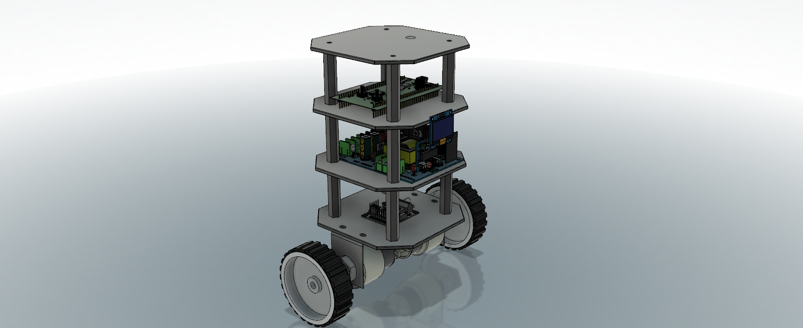
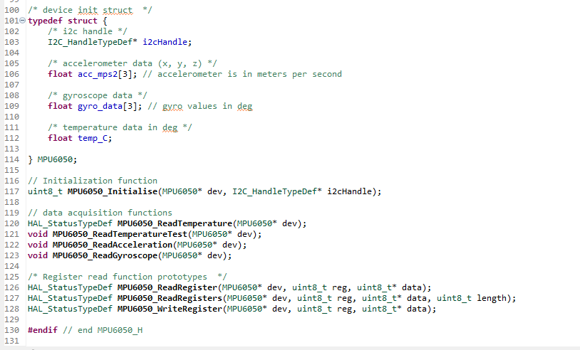
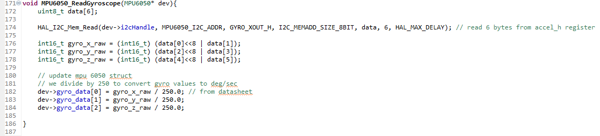
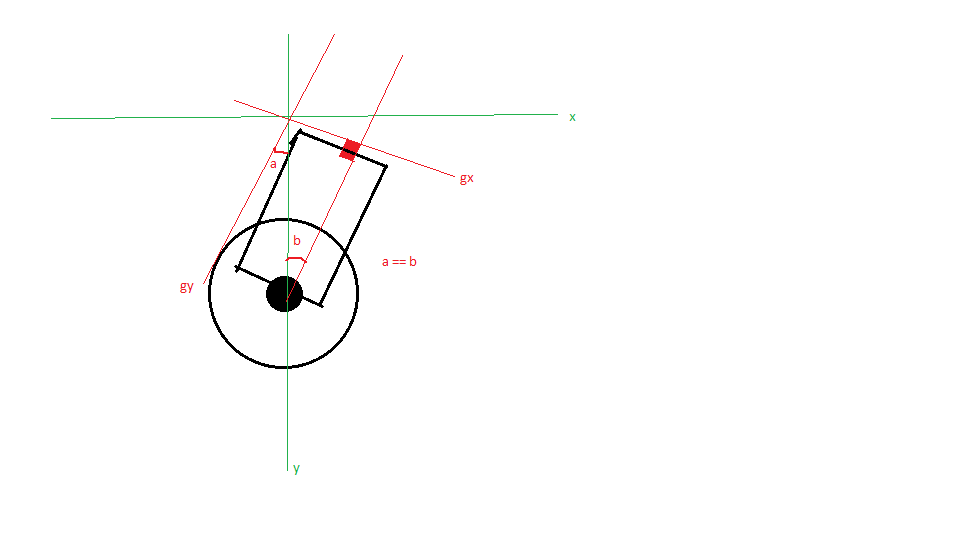
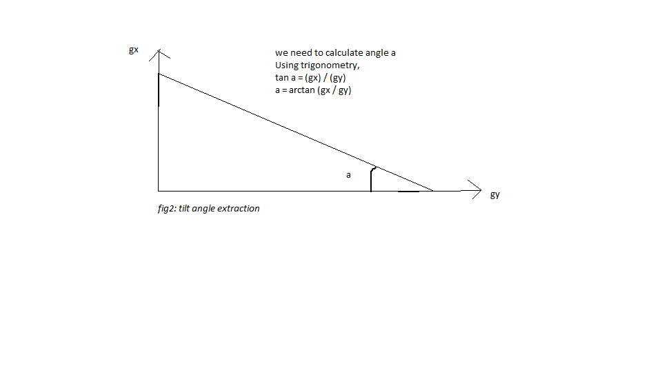
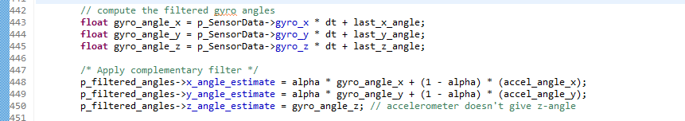
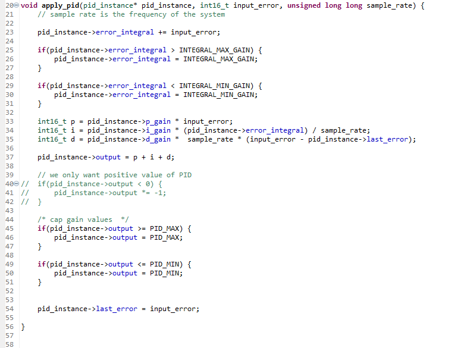

## Mealy - A self-balancing robot


## About
Mealy is a robot build with the aim of making it self-balancing on two wheels, using an MPU6050 IMU and an
STM32F103C8T6 MCU. It is built for the sole reason of learning about control systems specifically the PID control algorithm, and how 
it is and can be applied to real robotics systems. This means that tuning the system, which is a major part of the bulding process,
is considered throughly. 



### Motivation 
This robot was inspired by a recent video I stumbled up on youtube (https://youtu.be/-bQdrvSLqpg), where the maker was tuning the  robot's PID gains 
visually, and at the same time using RF to control the robot, with an interface to show the gains and the effects. So I decided to build a cheaper version of the same 
for a start.

### At a glance
Mealy is controlled using an STM32F103C8T6 blue pill development board. The tilt angle is measured using an MPU6050 IMU. 
Wheels are driven using a pair of DC geared motors. The motor driver being used is L293D motor driver. 

### Specs

The following table shows the specifications listed for summary:

|Name | Spec |
|---|---|
|MCU|STM32F103C8T6 Bluepill|
|Inertial Measurement Unit|MPU6050|
|Motors|2 DC geared motors|
|Motor driver|L293D |
|Shape| Hexa-rectangular |
|Width(including wheels)|140 mm|
|Height| 180 mm |
|Control algorithm|PID|

### How it works

There are a few major moving parts on how a this self balancing robot works. 

#### Inertial Measurement Unit
The inertial measurement unit sensor used in MPU6050. Because the robot was developed using STM32 platform, MPU6050 driver had to be written so as to interface the sensor to the MCU. This driver allows us to perfom sensor data acquisition using registers and bit manipulation as referenced in the datasheet. 
The screen-shot below show a part of the MPU6050 driver header file:


The above screenshot shows some functions we needed to implement to receive data from the sensor. Of particular interest is the gyroscope and acceleration data. The gyroscope gives angular velocity on 3-axes (x, y, z). We can use this to determine the angular orientation of the robot. 



For the acceleration, we need to read from the accelerometer. At rest, the accelerometer gives us the acceleration due to gravity, also on 3 axes (x, y, z). 

So how does this data factor into our robot? 
Depending on how you mount your MPU6050 on the MCU, acceleration data on a particular axis will give you the data needed to calculate the tilt angle. The below images show an example of how we extract the tilt angle using x and y acceleration values:



Extracting the right angled triangle gives us the following: 


With this angle, we are ready to proceed!

#### Complementary Filter
The data we get from the IMU is full of noise. What we want is data that is clean enough that we can rely on. There are may filters for cleaning the data, but for this particular project, we implement a complementary filter. I referenced https://vanhunteradams.com/Pico/ReactionWheel/Complementary_Filters.html so as to implement an efficient filter. 

As the name suggests, the complementary filter combines gyro and accelerometer measurements. 

The gyroscope measures angular velocity. To do this, it perfoms gyro integration, also known as dead-reckoning. That is, calculating the current position based on the previous position. This presents a problem, if we integrate a position error overtime, we get a drift over long time. This means the gyro data drifts overtime, giving us errors after some time. However, if we want the angular velocity data over shorttime, the gyro is extremely useful and has low noise.

On the contrary, the accelerometer measures linear acceleration in m/s^2. Without motion, accelerometer reads the acceleration dur to gravity(9.81m/s^2). With motion, we need to factor the external force vectors. The accelerometer is accurate in long-term because no drift and earth's COG udually doesn't move. The problem is that the measurements are so noisy in short-term due to motion and noise.

So, to remove HF noise from the accelerometer, we use a low-pass filter. To remove LF noise from gyroscope we use a high-pass filter, and the complemetary filter helps us with this. Below is the formula used and its implementation:



#### PID
Proportional Integral Derivative control algorithm is used in this robot. PID is a control method commonly used in the industry. It consists of three coefficients; proportional, intefral and derivative which are varied to get the desired response. 
In simple terms, the tilt angle is read, then we compute the desired actuator output by calculating P, I and D values, then add them to compute the output which is then fed to the actuator.

The code below shows the implementation of PID used in this project:



```c main.c ``` showing how attach PID gains:


For this robot, the PID value used to compute the actuator output is the tilt angle. 
For more in-depth technical details about PID, you can visit https://www.ni.com/en/shop/labview/pid-theory-explained.html.


#### Motor driving
The motors used for this robot are controlled using L293D motor driver. The motors themselves are 2 Geared DC motors. These motors are powered by 12V from DC adapter. 


#### RGB
#### OLED


## 3D Model 

## Schematics 
Find The schematics and PCBs for this robot here: https://github.com/bytecod3/Mealy-PCB

## Future improvements

## References
